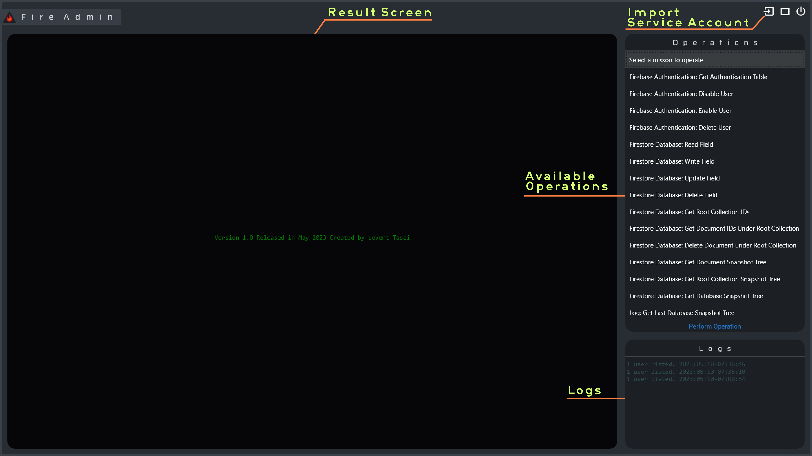

# FireAdmin

Bu proje, kullanıcıların FirebaseAdmin SDK ile Firebase ve Firestore Veritabanı'na erişim sağlamasına olanak tanıyan bir C# uygulamasıdır. Proje, uygulamalarında kullanıcılarını kimlik doğrulama ve yetkilendirme için Firebase kullananlara kolay erişim sağlamayı amaçlamaktadır.

    

Açık kaynak kodlu olarak oluşturduğum bu projeye ait detayları [github'da](https://github.com/leventtasci/FireAdmin/tree/master/FireAdmin)  inceleyebilirsiniz.

