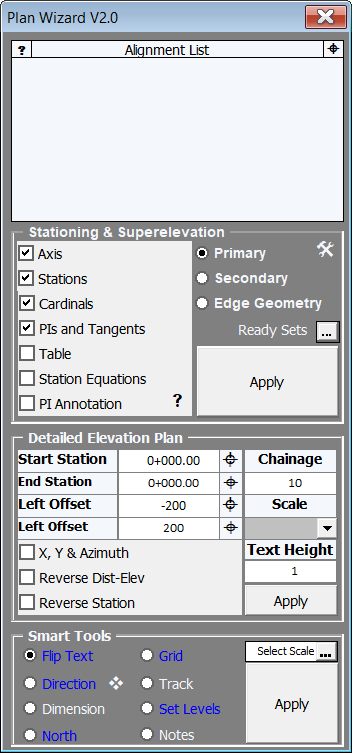

# Plan Sihirbazı

  
  
  

<h2 style="margin-top: 0;">Neden</h2>

  Güzergah işlerinden sorumlu teknik personeller, deveri, eksen bilgilerini, some bilgilerini, güzergah ile ilgili aplikasyon tablolarını, plan üzerine yazılacak kilometre-koordinat içeren bilgileri farklı kodlar veya manuel olarak yapmaya çalışırlar.
  Bu konuda yaygın olarak kullanılan yazılımların çoğunluğu tek bir yeteneğe sahiptir, çoğu Inroads ile bağlantılı çalışmaz; çalışma metodları rapor alma ve rapor okutma şeklindedir ve projelere özgü özelleştirilemezler veya toplu bir çözüm sunamazlar.

  ## Sonuç

  - Plan Sihirbazı, güzergah işlerinde tasarımcının eksen ile ilgili tüm çalışmalarında yardımcıdır; Dever hesaplarını  **AASHTO** ve  **KGM** ’nin çakışan kurplar için yayınladığı yönetmeliklere uygun olarak yapar. Dever ve kurp genişletme hesapları Plan Sihirbazı’nda iç içedir. Kurp genişletmeler seçilen araçlara göre hesaplanır, abaklardan okutulmaz. Çalışmalar excel’de yürütülür ve some bilgileri de excel’den çizime aktarılır. Çalışmaları kolaylaştıran, Inroads’un içerisinde bulunmayan, özelleştirilebilir tracking seçeneğine sahiptir.
  - Inroads ile bağlantılı çalışır.
  - Kavşak detay projelerinin tamamını Plan Sihirbazı ile üretmek mümkündür; aplikasyon tabloları, some bilgileri, kotlu planlar, kavşak adası koordinat bilgileri, plan notları, grid, pafta yön yazıları, platform ölçülendirmeleri gibi temel unsurların tamamını üretir.

  ## Öne Çıkan Özellikleri

  - Dever hesaplarını yönetmeliklere uygun olarak yapar, excel’e aktarır. Tasarımcının çalışmaları için dever ve kurp genişletme krokilerini üretir, çakışma olan noktalarda tasarımcıyı uyarır.
  - Kurp genişletme hesaplarını yapar, hesaplar esnektir ve farklı türde yollar ve araçlar için özelleştirilebilir.
  - Some bilgileri için gerekli geçiş boyu ve dever bilgilerini excel’den okur ve some bilgilerini bu veriye dayanarak oluşturur.
  - Standart KGM formatında ekseni, kilometrajı, teğetleri, kurplara ait kardinal bilgilerini tek bir seçimle istenilen ölçek ve aralıkta yazar. 
  - Kurp kardinal bilgileri, aplikasyon tablosundaki numaralara sahiptir (bu özellik Inroads’ta bulunmaz).
  - Kavşak kolları için gerekli semboloji ayrımını(some bilgileri dahil tüm çizilen bilgiler) “Secondary” seçimi ile kolayca yapar.
  - Kavşak kotlu planlarını basit seçimlerle türetir.
  - Aplikasyon ve kavşak ada koordinat tablolarını hazırlar.
  - Kilometre eşitliklerini her ürettiği çizim ve raporda dikkate alır.
  - Seçilen noktaya en yakın gridi üreten, özelleştirilebilir traking yapabilen, tüm yazıları bakış yönüne göre çevirebilen, platform ölçü çizgilerini çizebilen, yön göstergesini (kuzey’i kendisi bulur, kullanıcı cell’I çevirmez) yerleştiren, otomatik olarak girilen kilometreden koordinat ve kot hesaplayarak farklı formatta notlar yazabilen, projelerdeki neredeyse tüm plan işlerini yapabilen araçları içerisinde barındırır.

	

